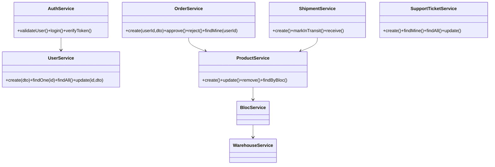
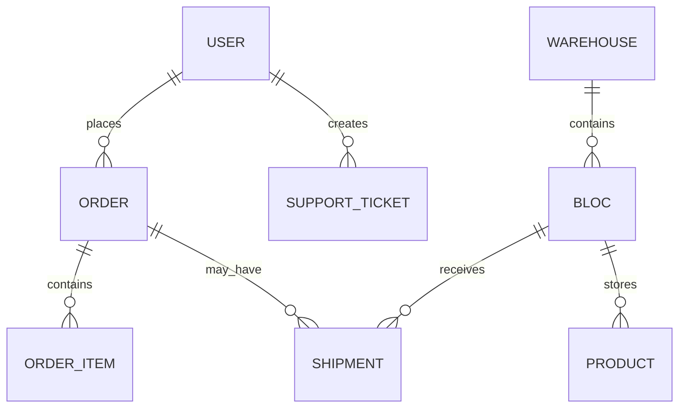

# Warehouse Pfe Project Documentary

## Mapping to the report (RAPPORT_CHAPTERS.md)

This documentary is aligned with the LaTeX report found in `RAPPORT_CHAPTERS.md`. The following table maps major documentary sections to the corresponding report chapters and locations to ensure consistency:

- Executive story & context: Chapter 1 — General Introduction ([RAPPORT_CHAPTERS.md](RAPPORT_CHAPTERS.md#L1))
- Sprint 0, requirements and architecture: Chapter 2 — Sprint 0: Specification and Planning ([RAPPORT_CHAPTERS.md](RAPPORT_CHAPTERS.md#L200))
- Release 1 (Auth, Onboarding, RBAC): Chapter 3 — Release 1: Foundation and Access Control ([RAPPORT_CHAPTERS.md](RAPPORT_CHAPTERS.md#L900))
- Product backlog, sprints and Gantt: Chapter 2 product backlog and Gantt sections ([RAPPORT_CHAPTERS.md](RAPPORT_CHAPTERS.md#L300))
- Diagrams (class/ER/sequence): referenced under `chapters/assets/` and embedded figures in the report (see respective chapter figures).
- Database schema: `warehouse-backend/prisma/schema.prisma` and the Prisma excerpt included in this documentary. Report references the same file path.

Action items to finalise sync:
- Export mermaid and UML diagrams to PNG and place them in `chapters/assets/` so both documents embed the same images.
- Insert Prisma schema excerpts into the report Chapter 3 Database Model section (if you want them shown inline in the LaTeX file).

## 1. Executive Story

This project is a full-stack Warehouse Management System built as two coordinated applications:

- `warehouse-backend`: a NestJS API with Prisma + PostgreSQL.
- `warehouse-frontend`: a Next.js App Router client with role-based workspaces.

At a narrative level, the system tells a clear operational story:

1. A person can register and enters the system as `PENDING`.
2. An administrator validates users and assigns operational roles.
3. Customers place product orders.
4. Managers and admins review, approve, reject, or trigger restock requests.
5. Shipments move through inbound states and replenish stock.
6. Orders are eventually completed and marked delivered.

The application is designed around traceable status transitions and strict role-based access control.

---

## 2. System Architecture

### 2.1 Backend Architecture

The backend follows modular NestJS architecture:

- `AuthModule`: login and current-session identity (`/auth/login`, `/auth/me`).
- `UserModule`: registration/profile management.
- `AdminModule`: user governance and role assignment.
- `WarehouseModule`: warehouse master data.
- `BlocModule`: storage units inside warehouses.
- `ProductModule`: inventory records linked to blocs.
- `OrderModule`: customer demand and delivery lifecycle.
- `ShipmentModule`: inbound logistics and restock completion.
- `PrismaModule`: persistence adapter.

Persistence is modeled in Prisma with strongly typed enums for roles and workflow states.

### 2.2 Frontend Architecture

The frontend uses Next.js with App Router plus client-side role state:

- Auth context keeps in-memory token and role.
- Route guard component (`AuthRedirect`) enforces access mode:
  - public-only pages (login/register).
  - protected pages with allowed role lists.
- Dedicated role areas under `/admin`, `/manager`, `/technicien`, `/customer`, and `/pending`.

This gives each actor a focused workspace while reusing shared shell/navigation components.

---

## 3. Domain Model and Entities

### 3.1 Core Entities

- `User`: identity, contact info, CIN, role.
- `Warehouse`: top-level physical facility.
- `Bloc`: storage subdivision of a warehouse, with capacity and current usage.
- `Product`: inventory item in a specific bloc.
- `Order`: customer demand request with approval and delivery state.
- `Shipment`: inbound replenishment unit, optionally linked to an order.

### 3.2 Key Enums (Business States)


- Bloc usage cannot exceed bloc capacity.
- Product create/update/delete updates bloc usage atomically.
- Order approval checks aggregate stock across matching products.
- Shipment receiving checks capacity and only then increments stock.
- Shipment receive can reset linked order status for re-review.

The project heavily uses transactions for consistency in stock movements.

---

## 4. Actors and User Roles (Detailed)

This section describes each actor as implemented by backend guards and frontend routing.
### 4.1 Actor: Administrator (`ADMIN`)

Mission:
- Governance and system control.
- User lifecycle supervision.
- Full participation in operational decision points (orders, stock structures).

Backend capabilities:
- Full `/admin/users` management (create/read/update/delete users).
- Can access order decision endpoints (`approve`, `reject`, `restock-request`, `delivered`).
- Can manage warehouses and blocs.
- Can manage products.
- Can access shipment management endpoints.

Frontend experience:
- Redirect target: `/admin`.
- Main areas: users, warehouses, warehouse details/blocs, products, profile.
- Critical responsibility: moving users out of `PENDING` into active roles.

Narrative importance:
- Administrator is the gatekeeper that transforms anonymous registration into controlled access.
- This role is the primary policy actor of the platform.

### 4.2 Actor: Manager (`MANAGER`)

Mission:
- Orchestrate the fulfillment lifecycle from pending order to delivery.
- Drive restock decisions when stock is insufficient.

Backend capabilities:
- Read all orders.
- Approve/reject orders.
- Trigger restock requests for specific blocs.
- Mark orders as delivered.
- Full shipment operations (`create`, `in-transit`, `receive`, etc.).
- Manage warehouses, blocs, and products (shared with admin/technicien depending on area).

Frontend experience:
- Redirect target: `/manager`.
- Workspaces:
  - Orders (table/kanban/calendar perspective, action buttons).
  - Shipments (transit + receive workflows).
  - Products and Warehouses (operational visibility).

Narrative importance:
- Manager is the control tower of the warehouse: converting demand signals into stock, shipment, and delivery actions.

### 4.3 Actor: Technician (`TECHNICIEN`)

Mission:
- Maintain inventory-level operations.

Backend capabilities:
- Product management rights exist in backend role guards for product endpoints.
- No warehouse/bloc structural management rights.

Frontend experience:
- Redirect target: `/technicien`.
- Current dashboard is lighter and mostly a shell for product-centric work.

Narrative importance:
- Technician is modeled as an operational specialist role, currently less feature-rich on UI than manager/admin.
- The backend already reserves a meaningful product-management authority for this role.

### 4.4 Actor: Customer (`CUSTOMER`)

Mission:
- Discover available products and submit demand.
- Track progress of own orders.

Backend capabilities:
- Access only customer-specific order endpoints:
  - available product names + total quantities.
  - own order list.
  - order creation.
  - order tracking restricted to own order ID.

Frontend experience:
- Redirect target: `/customer`.
- Workspace tabs:
  - Products list.
  - Orders list with status filtering.
  - New order form prefilled from profile data.

Narrative importance:
- Customer is the demand origin actor.
- Their actions trigger internal workflows handled by manager/admin.

### 4.5 Actor: Pending User (`PENDING`)

Mission:
- Await administrative approval and role assignment.

Backend/registration behavior:
- Public registration endpoint creates users as `PENDING`.
- This role cannot enter operational workspaces.

Frontend behavior:
- Redirect target: `/pending`.
- Pending page communicates approval waiting state.

Narrative importance:
- This role is a deliberate quarantine state to protect business operations from unvetted access.


## 5. End-to-End Workflow Documentary

### 5.1 Onboarding and Access Control Flow

2. Backend stores hashed password and marks role `PENDING`.
3. User can authenticate but is redirected to pending workspace.
5. On next login, role-based redirect lands the user in the assigned domain workspace.

This creates a secure two-step onboarding: account creation then authorization.
### 5.2 Customer Order Lifecycle
1. Customer browses available product aggregates (`/orders/products`).
2. Customer submits order (`/orders/create`).
   - Approve: stock is decremented, delivery goes in-progress.
5. Delivered marking closes lifecycle into `COMPLETED` + `DELIVERED`.

   - `REQUESTED` -> `IN_TRANSIT` -> `RECEIVED`.
   - linked order may be reset to pending review.


- Shipment reception cannot overfill a bloc.
- Order approval consumes stock and reduces bloc usage accordingly.

---

## 6. Role-to-Capability Matrix

### 6.1 Functional Summary

- `ADMIN`
  - User governance.
  - Full operational control across warehouses, blocs, products, orders, shipments.
- `MANAGER`
  - Operational execution: orders and shipments.
  - Broad inventory visibility and management tooling.
- `TECHNICIEN`
  - Product-focused inventory role.
  - Restricted from warehouse/bloc structural governance.
- `CUSTOMER`
  - Create and monitor own orders only.
- `PENDING`
  - Authenticated but blocked from operations pending approval.

### 6.2 Security Model Notes

- Role checks are enforced server-side by guards and decorators.
- Frontend route guards improve UX but backend remains final authority.
- JWT payload carries role and identity claims used for guard decisions.

---

## 7. UX and Product Design Perspective

The frontend intentionally separates concerns by actor workspaces:

- Admin area: governance and configuration.
- Manager area: high-tempo operational actions.
- Customer area: simplified demand + tracking experience.
- Pending area: waiting room to avoid unauthorized workflow access.

Common UX patterns include:

- role-colored workspace shells,
- status badges,
- optimistic refresh after actions,
- explicit error extraction from backend messages.

---

## 8. Technical Strengths and Observations

### 8.1 Strengths

- Clean domain model and status-driven workflow.
- Strong role taxonomy with practical business meaning.
- Transactional updates for stock-sensitive operations.
- Clear separation between customer-facing demand and internal fulfillment.
- Frontend route segmentation mirrors backend role model well.

### 8.2 Observations / Opportunities

- Some controllers still import guards from `auth_old` paths while app uses current auth module; behavior works but consolidation would reduce architectural ambiguity.
- Frontend auth state is memory-only (token not persisted across reload), which may be intentional for security but impacts session continuity.
- Technician backend authority is richer than current technician UI, suggesting room to expand this workspace.

---

## 9. Documentary Conclusion

Warehouse Pfe is a role-driven warehouse operations platform where identity, approval, inventory capacity, and fulfillment state transitions are tightly connected.

The heart of the system is not just CRUD over warehouses and products; it is the choreography between actors:

- customers create demand,
- managers/admins arbitrate fulfillment,
- shipments restore supply,
- administrators enforce governance,
- pending users are held until explicitly trusted.

In short, this project behaves like an operational control system with layered access, physical constraints, and traceable business state changes, rather than a simple inventory listing tool.

---

## 10. Project Plan — Sprint 0 + 6 Sprints (7 total)

Overview: plan assumes 2-week sprints (14 weeks total after Sprint 0). Each sprint includes a concise goal, scope, and clear acceptance criteria you can use in your PFE evaluation.

Sprint 0 — Project Setup & Research (Weeks 1-2)
+Goal: Prepare the environment, research architecture, finalize tech stack, and create initial project artifacts.
+Scope: Initialise repo, create `README`, configure development Postgres, create Prisma baseline, scaffold NestJS and Next.js apps, set CI linting and prettier, create initial `PROJECT_DOCUMENTARY.md` and sprint backlog.
+Acceptance: Developers can run backend and frontend locally; `prisma migrate dev` and `prisma generate` succeed; README contains run instructions and basic architecture diagrams.

Sprint 1 — Auth & Onboarding (Weeks 3-4)
+Goal: Implement secure authentication and onboarding UX (register → pending → role assignment).
+Scope: Registration, login, JWT issuance, `PENDING` onboarding behavior, profile update, and basic auth guards on backend; frontend login/register and pending page.
+Acceptance: Users can register and appear as `PENDING`; admins can list and change roles; protected endpoints return 401 for unauthenticated requests; demo script for onboarding works end-to-end.

Sprint 2 — User Management & RBAC (Weeks 5-6)
+Goal: Admin-grade user governance and UI for role assignment.
+Scope: Admin user CRUD endpoints, role assignment endpoint, frontend admin users dashboard, server-side guards enforcement, unit tests for role-protected endpoints.
+Acceptance: Admin can create/update/delete users and change roles via API/UI; role-protected endpoints deny access for unauthorized roles and tests cover those cases.

Sprint 3 — Warehouse & Bloc Management (Weeks 7-8)
+Goal: Model physical storage and enforce capacity constraints.
+Scope: Warehouse and Bloc CRUD APIs, bloc capacity enforcement in services, frontend admin pages to manage warehouses and blocs, tests for capacity rules.
+Acceptance: Creating/updating blocs and warehouses works; attempts to create/receive stock that would overfill a bloc are rejected with clear error codes; automated tests verify constraints.

Sprint 4 — Product Catalog & Dynamic Pricing (Weeks 9-10)
+Goal: Complete product catalog and integrate dynamic pricing basics.
+Scope: Product CRUD, assign products to blocs, price and quantity fields, implement server-side totalAmount calculation for orders (unitPrice × quantity), simple quantity-based discount rules (optional), frontend product pages for customers and admin.
+Acceptance: Products can be created/updated with bloc assignment; order creation payload includes server-validated `totalAmount`; pricing rules applied and documented in tests/examples.

Sprint 5 — Orders & Shipments (Weeks 11-12)
+Goal: Implement multi-item order lifecycle and shipment/restock flows.
+Scope: `OrderItem` model, `POST /orders/create` supporting multiple items, manager approval/rejection endpoints, shipment create/in-transit/receive workflow, order tracking endpoint, frontend order modal and manager workflows.
+Acceptance: Customer can place multi-item orders; manager can approve/reject; approving an order decrements stock in a transaction; shipment receive increments stock and may change order state; end-to-end demo available.

Sprint 6 — Inventory Ops, Support Tickets, Data & Chatbot, Real-time & Hardening (Weeks 13-16)
+Goal: Combine remaining operational features, analytics prep, chatbot and real-time hardening for PFE delivery.
+Scope: Technician UI for product placement, support-ticket lifecycle, operational events table and ETL scripts, lightweight chatbot integration, SSE/WebSocket real-time updates, tests, and deployment packaging.
+Acceptance: Technician can open tickets; admins/managers can update tickets; operational events are recorded; ETL produces a CSV sample; chatbot creates tickets; connected clients receive real-time updates; README contains demo script.

---

## 11. Product Backlog (Prioritized — user stories)

The backlog below is prioritized for an academic PFE. Each item is expressed as a user story in the format: "As a <role>, I want <capability> so that <benefit>." Story points (Est) remain for relative sizing.

- PB-01 — Authentication & RBAC (Priority: High, Est: 5)
  - As a **user**, I want to register and login securely so that my account and data are protected.
  - As an **admin**, I want to assign roles to users so that only authorized personnel access operational features.

- PB-02 — Warehouse / Bloc CRUD + capacity checks (Priority: High, Est: 8)
  - As an **admin**, I want to create and configure warehouses and blocs so that physical storage is modelled accurately.
  - As a **manager**, I want the system to prevent operations that would overfill a bloc so that inventory reflects physical constraints.

- PB-03 — Product Catalog CRUD & bloc assignment (Priority: High, Est: 8)
  - As an **admin/manager**, I want to create and edit products (specs, price, quantity) and assign them to blocs so that inventory is trackable by location.
  - As a **technician**, I want to change a product's `blocId` when moving stock so that location data stays accurate.

- PB-04 — Multi-item Orders + Order Items model (Priority: High, Est: 8)
  - As a **customer**, I want to place an order containing multiple products in one transaction so that I can buy different items together.
  - As a **manager**, I want orders to include itemized lines so that approvals and stock adjustments are precise.

- PB-05 — Order approval/rejection workflow (Priority: High, Est: 5)
  - As a **manager**, I want to approve or reject customer orders with notes so that business decisions are documented and stock is reserved only on approval.

- PB-06 — Shipment lifecycle + receive logic (Priority: High, Est: 8)
  - As a **manager**, I want to create and progress shipments through `REQUESTED` → `IN_TRANSIT` → `RECEIVED` so that restocking is traceable.
  - As a **technician**, I want receiving a shipment to update product quantities and bloc usage atomically so that inventory remains consistent.

- PB-07 — Support tickets (technician → admin/manager) (Priority: Medium, Est: 5)
  - As a **technician**, I want to open a support ticket describing an issue so that admins/managers can triage and resolve operational problems.
  - As an **admin/manager**, I want to view and update tickets so that issues are tracked and closed.

- PB-08 — Technician product placement UI (Priority: Medium, Est: 5)
  - As a **technician**, I want a focused UI to assign products to specific blocs and record stock movements so that daily operations are efficient.

- PB-09 — Operational events & movement history (Priority: Medium, Est: 8)
  - As a **manager/admin**, I want an event log of receipts, movements, and adjustments so that I can audit changes and build datasets for analytics.

- PB-10 — Reporting (orders/inventory) and CSV export (Priority: Medium, Est: 5)
  - As a **manager**, I want reports and CSV export of orders and inventory snapshots so that I can analyze trends and include data in reports.

- PB-11 — Real-time updates (SSE/WebSockets) (Priority: Medium, Est: 8)
  - As a **manager/technician/customer**, I want to receive real-time updates about order/shipment status so that dashboards reflect the latest state without manual refresh.

- PB-12 — Notifications (email/push) for delivered orders (Priority: Low, Est: 8)
  - As a **customer**, I want to receive a notification when my order is delivered so that I know the delivery event occurred.

- PB-13 — Chatbot for support ticket creation and order queries (Priority: Low, Est: 8)
  - As a **technician/customer**, I want a chatbot to create tickets or query order status so that I can get help or file issues quickly.

Notes: Est = story points (relative). Convert to hours in your project plan (e.g., 1 point ≈ 4 hours) as needed for PFE scheduling.

---

## 12. Class Diagram & Core Server Classes

Below is a succinct class-level description for use in your PFE UML diagrams. Implementations live in `warehouse-backend/src`.

- `UserService` — responsibilities: create/update users, find by email, list users, hash passwords.
- `AuthService` — validate credentials, generate JWTs.
- `AdminService` — wrappers around `UserService` for admin operations (role change, create user).
- `WarehouseService` — create/read/update/delete warehouses and compute aggregate bloc usage.
- `BlocService` — manage blocs, capacity checks and relationships to `Warehouse`.
- `ProductService` — CRUD products; when moving or adjusting quantity, update `Bloc` usage and write operational events.
- `OrderService` — create orders (items), find orders, approve/reject orders, decrement stock on approve, create restock requests.
- `ShipmentService` — create shipments, mark in-transit, receive shipments (increment stock, validate capacity).
- `SupportTicketService` — create tickets, find mine, list, update status/manager notes.

Mermaid class overview (use in report):



---

## 13. Database Tables (Prisma mapping)

Use these model summaries in diagrams and tables. They map to `prisma/schema.prisma`.

- `User` (id, email, name, password, address, phone, cin, profilePicture, roles, createdAt, updatedAt)
- `Warehouse` (id, name, description, surface, createdAt, updatedAt)
- `Bloc` (id, name, capacity, currentUsage, warehouseId, createdAt, updatedAt)
- `Product` (id, name, blocId, description, price, quantity, createdAt, updatedAt)
- `Order` (id, customerId, productName (legacy), quantity (legacy), totalAmount, deliveryDeadline, deliveryAddress, customerName, customerPhone, status, deliveryStatus, managerNote, rejectionReason, createdAt, updatedAt)
- `OrderItem` (id, orderId, productId, productName, unitPrice, quantity, lineTotal, createdAt, updatedAt)
- `Shipment` (id, orderId?, type, productName, quantity, blocId, supplierName, trackingNumber, expectedAt, receivedAt, status, note)
- `SupportTicket` (id, title, category, description, priority, status, managerNote, createdById, createdAt, updatedAt)

ER diagram (mermaid):



---

## 14. Chatbot Architecture (for PFE)

Goal: a lightweight conversational assistant that helps technicians/customers create support tickets and ask simple order/product queries.

Core components:
- NLU / Intent Recognition: Use a hosted service (Dialogflow, Rasa, or LLM + prompt templates). Recognize intents: `create_ticket`, `query_order_status`, `query_product_availability`, `greeting`, `fallback`.
- Dialogue Manager: Stateless or minimal state machine to collect required slots (e.g., ticket title, description, product/quantity, bloc if relevant).
- Integration Layer: securely call backend APIs:
  - `POST /support-tickets` to create a ticket (requires JWT of technician)
  - `GET /orders/:id/tracking` for order queries (requires user token or manager/admin token with appropriate scope)
  - `GET /product` or `GET /product/bloc/:blocId` for availability queries
- Authentication: token-forwarding approach: chatbot UI (embedded in workspace) uses current user's JWT; backend enforces RBAC.
- Fallback/Error handling: if the bot cannot satisfy an intent, escalate to a ticket creation flow or show contact details.

Recommended minimal flow for `create_ticket`:
1. User invokes bot (in `/technicien` workspace -> bot already has JWT via browser session).
2. Bot asks: "Brief title?" -> user replies.
3. Bot asks: "Describe the issue and which product/bloc if applicable." -> user replies.
4. Bot calls `POST /support-tickets` with `title`, `description`, `category` (inferred), `priority`.
5. Bot responds with ticket ID and link to technician ticket list.

Security considerations:
- Ensure the frontend injects the JWT into the bot requests or the bot uses the browser session to authorize.
- Rate-limit bot actions and validate all inputs on server.

Implementation options (from simplest to robust):
- Option A (fast, low-code): Use a prompt-based LLM with simple slot-filling logic in the browser and call backend endpoints directly.
- Option B (moderate): Use a managed NLU (Dialogflow) for slot-filling and small webhook service for backend calls.
- Option C (advanced): Host Rasa or build a small Node.js microservice that manages dialogues and secure backend calls.

---

## 15. Testing Strategy

- Unit tests for services (Prisma operations mocked) — validate business rules (capacity checks, stock decrement on approve).
- Integration tests for critical flows: registration → admin role assignment → customer order → manager approve → stock update.
- E2E smoke tests using playwright or Cypress for main role flows (customer order creation and admin approval).
- Load test for shipment/receive endpoints is optional for PFE but valuable if you claim performance properties.

---

## 16. Deployment & DevOps Notes

- Dev: `nest start --watch` for backend (port 3001 expected), Next.js dev server for frontend.
- Database: Postgres (local or containerized). Run `prisma migrate dev` and `prisma generate` after schema changes.
- Recommended for PFE demo: Docker Compose with `postgres`, `backend`, and `frontend` services — simplifies demo reproducibility.

Example Docker Compose advice (high level):
1. Postgres service with mounted volume.
2. Backend built image that runs `prisma migrate deploy` on start and binds to 3001.
3. Frontend served using Next.js production server or `next start` after build.

---

## 17. Deliverables for PFE Report (Checklist)

- Project overview and architecture diagrams (class and ER diagrams)
- Sprint log with objectives and completed tasks for each sprint (use Sprints 1–8 above)
- Product backlog with priorities and estimates
- API reference summary (routes, expected payloads, roles)
- Test plan and major test results (unit + integration + E2E smoke)
- Deployment instructions and demo scripts
- Chatbot design and sequence diagrams
- Source code link and commit history summary

---

If you want, I can:
- generate UML images or export the mermaid diagrams to PNG for insertion into your report;
- create a printable sprint-by-sprint activity log (`SPRINT_LOG.md`) that you can paste into your PFE appendix;
- or convert the backlog into a CSV/Excel for PM chapters.

Tell me which of those you want next and I'll prepare it.

---

## Detailed Project Resume

This section is a concise, shareable resume of the Warehouse Pfe project suitable for emailing to supervisors, reviewers, or teammates. It summarizes the goals, architecture, data model, important workflows, and how to run the system locally.

- Project: Warehouse Pfe — full-stack Warehouse Management System for order, shipment and inventory lifecycle management.
- Stack: Backend — NestJS, TypeScript, Prisma ORM, PostgreSQL. Frontend — Next.js (App Router), TypeScript, React. Development tooling: Jest, Playwright/Cypress (E2E), ESLint, Prettier.
- Primary capabilities: role-based access control (ADMIN, MANAGER, TECHNICIEN, CUSTOMER, PENDING), transactional stock updates, shipment receive and restock flows, multi-item orders, support-ticket integration and a lightweight chatbot assistant.
- Key constraints: bloc capacity enforcement, atomic stock movements using database transactions, server-side RBAC enforced by guards and decorators.

Contactable summary (1-paragraph): Warehouse Pfe models a real-world warehouse where customers place orders, managers/admins validate and fulfill them, technicians operate inventory, and shipments restore stock. The system guarantees consistency by using Prisma transactions to protect stock updates and implements strict role-based access control both in the frontend and backend.

---

## Technical Architecture Deep-Dive

### Backend (warehouse-backend)

- Structure: Modular NestJS architecture with modules for `auth`, `user`, `admin`, `product`, `bloc`, `warehouse`, `order`, `shipment`, `support-ticket`, and `prisma` integration.
- Persistence: Prisma Client with a PostgreSQL database. The `PrismaModule` centralizes client creation and graceful disposal. Migrations live under `prisma/migrations/` and generated client code appears under `generated/prisma/`.
- Services: Business logic is implemented in services (e.g., `OrderService`, `ShipmentService`) and controllers expose HTTP endpoints. Services use Prisma transactions (`$transaction`) to perform multi-step stock updates atomically.
- Security: JWT-based authentication; backend guards enforce role checks. Sensitive operations (approve order, receive shipment) validate capacity and ownership restrictions server-side.
- Error model: Controllers return structured HTTP errors with codes and machine-readable payloads for frontend consumption. Capacity checks return specific error codes so UI can show actionable messages.

### Frontend (warehouse-frontend)

- Structure: Next.js App Router with per-role route segments under `/admin`, `/manager`, `/technicien`, `/customer`, `/pending`.
- Auth: Browser stores JWT in-memory (recommended pattern in current codebase). Route guard component (`AuthRedirect`) redirects users to the appropriate workspace and blocks unauthorized access. Token should be forwarded with `Authorization: Bearer <token>` for API calls.
- UX patterns: role-colored shells, status badges, optimistic UI updates on common actions, and concise error display extracted from backend responses.

### Integration & Chatbot

- The chatbot integrates with backend endpoints for ticket creation and order queries. It forwards the logged-in user's JWT for RBAC enforcement. Intent recognition can be LLM-based or via a light NLU.

---

## Data Model & Prisma Excerpts

Below are representative Prisma schema excerpts to include in documentation and the report; see [warehouse-backend/prisma/schema.prisma](warehouse-backend/prisma/schema.prisma) for the full schema.

Example core models:

```prisma
model User {
  id        Int      @id @default(autoincrement())
  email     String   @unique
  name      String?
  password  String
  role      Role     @default(PENDING)
  createdAt DateTime @default(now())
  updatedAt DateTime @updatedAt
}

enum Role {
  ADMIN
  MANAGER
  TECHNICIEN
  CUSTOMER
  PENDING
}

model Bloc {
  id          Int      @id @default(autoincrement())
  name        String
  capacity    Int
  currentUsage Int     @default(0)
  warehouse   Warehouse @relation(fields: [warehouseId], references: [id])
  warehouseId Int
}

model Product {
  id        Int      @id @default(autoincrement())
  name      String
  bloc      Bloc?    @relation(fields: [blocId], references: [id])
  blocId    Int?
  quantity  Int      @default(0)
  price     Float
}
```

Important notes:
- All inventory mutations that affect `Bloc.currentUsage` and `Product.quantity` are executed inside a transaction and validated against `Bloc.capacity` to prevent overfill.
- Orders use `Order` + `OrderItem` models to support multi-item transactions.

---

## API Summary (example endpoints and payloads)

This summary highlights the most important API routes a reviewer will want to inspect. Full controllers are under `warehouse-backend/src/*/controller.ts`.

- Auth
  - `POST /auth/login` — body: `{ email, password }` -> returns `{ accessToken, user }`.
  - `GET /auth/me` — header: `Authorization: Bearer <token>` -> returns current user payload.

- Users / Admin
  - `GET /admin/users` — list users (ADMIN role required).
  - `PATCH /admin/users/:id/role` — body: `{ role }` to change role.

- Warehouses & Blocs
  - `POST /warehouses` — create warehouse (ADMIN/ MANAGER allowed).
  - `POST /blocs` — create bloc with `capacity` and `warehouseId`.

- Products
  - `POST /products` — create product with `blocId`, `quantity`, `price`.
  - `PATCH /products/:id/transfer` — move product to another bloc (validates target capacity).

- Orders
  - `POST /orders/create` — body: `{ items: [{ productId, quantity }], deliveryAddress, customerName }` — creates `Order` and `OrderItem`s.
  - `POST /orders/:id/approve` — manager approves; service decrements stock in transaction.

- Shipments
  - `POST /shipments` — create restock shipment (optionally linked to order).
  - `POST /shipments/:id/receive` — mark received; increments product quantities after capacity validation.

Example approval flow (high-level):
1. Manager calls `POST /orders/:id/approve`.
2. Server checks all `OrderItem` availability across blocs.
3. If available, server opens a transaction: decrement `Product.quantity`, update `Bloc.currentUsage`, set `Order.status` to `APPROVED`.

---

## Deployment, CI and Run Commands

Local dev (backend):

```bash
cd warehouse-backend
pnpm install
pnpm prisma:migrate:dev   # or `npx prisma migrate dev`
pnpm prisma:generate
pnpm start:dev            # runs NestJS with watch
```

Local dev (frontend):

```bash
cd warehouse-frontend
pnpm install
pnpm dev                 # Next.js dev server
```

CI/Production notes:
- Use `prisma migrate deploy` in CI/CD pipelines to apply migrations.
- Build backend and frontend artifacts separately; backend should run migrations on startup in deploy scripts if appropriate.
- For reproducible demos, prefer a `docker-compose.yml` that boots Postgres, the backend, and the frontend.

---

## Testing & Quality Assurance (expanded)

- Unit tests: Services and guards should be covered with unit tests using Jest and Prisma mocking. Focus on capacity rules and transactional consistency.
- Integration tests: Use a disposable test database (Postgres container). Test flows: registration → admin role assignment → create order → approve → stock changes.
- E2E: Use Playwright or Cypress to test the main role flows: customer order creation, manager approval, shipment receive.

Commands (examples):

```bash
cd warehouse-backend
pnpm test

cd warehouse-frontend
pnpm test:e2e
```

---

## Diagrams, Assets, and Report Embedding

- Export mermaid diagrams as PNG/SVG and place them in `chapters/assets/` so the LaTeX report embeds the same images. Keep source mermaid files in a `diagrams/` folder for future edits.
- Suggested naming: `diagrams/class_diagram.mmd`, `chapters/assets/class_diagram.png`.

---

## Appendix: Reviewer Checklist

- Run `pnpm install` in both apps and start services locally.
- Inspect `prisma/schema.prisma` for model details and enums.
- Verify `POST /orders/create` and `POST /orders/:id/approve` flows using Postman or curl.
- Review `src/*/service.ts` files for transaction usage and capacity checks.

---

If you want, I can now:
- export the mermaid diagrams to PNG and place them in `chapters/assets/`;
- generate a one-page PDF resume for the project from this documentary;
- or create the `SPRINT_LOG.md` printable sprint-by-sprint activity log.

Tell me which of those you want next and I will proceed.
